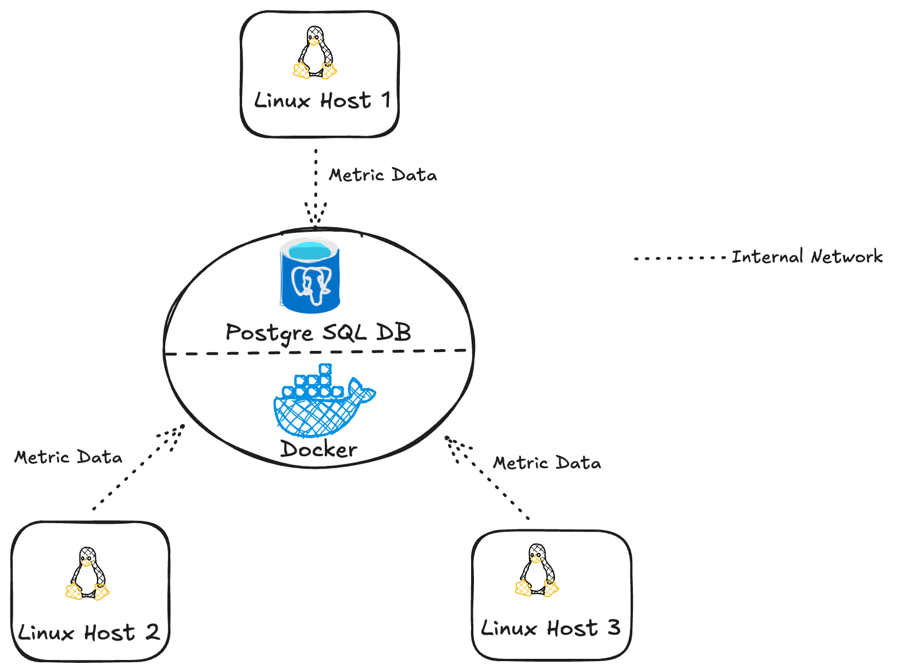

# Linux Cluster Monitoring Agent

## Introduction

This project implements a **Linux Cluster Monitoring Agent** designed to collect and store hardware specifications and real-time resource usage data from multiple Linux hosts. The system focuses on monitoring key metrics such as CPU and memory utilization and persisting them in a centralized relational database for analysis.

The solution is intended for system administrators and DevOps engineers who need lightweight visibility into the health and performance of a small Linux cluster without relying on heavyweight third-party monitoring platforms. Each host runs bash-based monitoring scripts that gather system information and periodically push usage metrics to a centralized PostgreSQL database.

Docker is used to provision the PostgreSQL database in a consistent and reproducible environment, while `cron` schedules the execution of the Bash scripts at regular intervals. Source code is managed using Git, and collected data can be queried using SQL to support performance analysis and capacity planning.

## Quick Start

Follow the steps below to deploy the database, initialize schema, and start collecting host metrics.

```bash
# 1. Start PostgreSQL using Docker
# This launches a PostgreSQL container with the specified password.
./scripts/psql_docker.sh start <db_password>

# 2. Create database tables
# This initializes the required schema in the host_agent database.
psql -h localhost -U postgres -d host_agent -f sql/ddl.sql

# 3. Insert host hardware specifications
# This script collects static host information and inserts it into the database. It should be executed once per host.
./scripts/host_info.sh localhost 5432 host_agent postgres <db_password>

# 4. Insert host resource usage snapshot
# This script collects current CPU and memory usage and inserts a single record.
./scripts/host_usage.sh localhost 5432 host_agent postgres <db_password>

# 5. Set up scheduled data collection
# Configure cron to run the usage collection script at a fixed interval (e.g., every minute).
crontab -e 
```
## Implemenation

This section describes how the Linux Cluster Monitoring Agent is implemented, including system architecture, monitoring scripts, and database design. The solution uses Bash-based agents to collect system metrics from Linux hosts and persists the data in a centralized PostgreSQL database for analysis.

### Architecture

The system follows a centralized monitoring architecture. Multiple Linux hosts run lightweight Bash agents that collect hardware information and resource usage metrics. These agents communicate with a centralized PostgreSQL database deployed using Docker. All hosts are connected through an internal network, allowing metrics to be transmitted securely and efficiently.

The cluster architecture diagram is stored in the `assets/` directory and illustrates the interaction between hosts, agents, and the database.

### Scripts

This project uses several Bash scripts to deploy the database, collect system metrics, and support monitoring and analysis.

#### psql_docker.sh

This script manages the PostgreSQL database using Docker. It is responsible for starting and stopping the database container and ensuring the database service is available for metric ingestion.

```bash
./scripts/psql_docker.sh start <db_password>
./scripts/psql_docker.sh stop 
```

#### ddl.sql

This SQL script automates database schema initialization. It creates the required tables for the monitoring system if they do not already exist. The script assumes that the **host_agent** database has been created and focuses only on table definitions.
This script ensures schema creation is repeatable and eliminates manual setup steps during deployment.

``` bash
psql -h localhost -U postgres -d host_agent -f sql/ddl.sql
```

#### host_info.sh

This script collects static hardware information from a Linux host, including CPU architecture, number of cores, and total memory. The data is inserted into the **host_info** table and is intended to be executed once per host during initial setup.

```bash
./scripts/host_info.sh localhost 5432 host_agent postgres <db_password>
```

#### host_usage.sh

This script collects real-time CPU and memory usage metrics from the host. Each execution captures a single usage snapshot and inserts it into the **host_usage** table for time-series analysis.

``` bash
`./scripts/host_usage.sh localhost 5432 host_agent postgres <db_password>
```

#### crontab

The **host_usage.sh** script is scheduled using **cron** to run at fixed intervals (e.g., once per minute). This enables automated and continuous collection of host resource usage data.


### Database Modeling

The database schema is designed to separate static host metadata from time-series resource usage metrics. This structure supports efficient querying, scalability, and clear relationships between hosts and their usage data.

#### host_info

The `host_info` table stores static hardware and system information for each Linux host. Each record represents a unique host in the cluster.

| Column Name        | Description |
|-------------------|-------------|
| id                | Unique identifier for the host |
| hostname          | Host machine name (unique) |
| cpu_number        | Number of CPU cores |
| cpu_architecture  | CPU architecture type |
| cpu_model         | CPU model name |
| cpu_mhz           | CPU clock speed in MHz |
| l2_cache          | L2 cache size |
| total_mem         | Total system memory |
| timestamp         | Record creation timestamp |

---

#### host_usage

The `host_usage` table stores time-series resource usage metrics collected from each host. Multiple usage records can exist for a single host over time.

| Column Name      | Description |
|------------------|-------------|
| timestamp        | Time when the usage snapshot was collected |
| host_id          | Reference to the corresponding host |
| memory_free      | Available memory at collection time |
| cpu_idle         | CPU idle percentage |
| cpu_kernel       | CPU kernel usage percentage |
| disk_io          | Disk I/O activity |
| disk_available   | Available disk space |

---

## Test

The Bash scripts and database DDL were tested locally on a single Linux machine to validate correctness and functionality.

For the database layer, the `sql/ddl.sql` script was executed against the PostgreSQL instance to verify that both `host_info` and `host_usage` tables were created successfully without errors. Successful table creation was confirmed using PostgreSQL metadata queries.

The `host_info.sh` script was tested by executing it manually and verifying that host hardware information was correctly inserted into the `host_info` table.

The `host_usage.sh` script was tested by scheduling it with `cron` to run at a fixed interval. Multiple executions were observed over time, and timestamped usage records were verified in the `host_usage` table to confirm that automated, periodic data collection was functioning as expected.

All scripts executed successfully and produced the expected results.

## Deployment

The application is deployed using Git for source control, Docker for database provisioning, and `cron` for scheduling automated data collection.

The PostgreSQL database is deployed as a Docker container using the `psql_docker.sh` script to ensure a consistent and reproducible environment. Source code is managed and versioned using Git and hosted on GitHub. The monitoring agent scripts are deployed directly on each Linux host.

The `host_usage.sh` script is scheduled using `crontab` to run at fixed intervals (e.g., once per minute), enabling continuous and automated collection of system resource metrics.

## Improvements

The following improvements could be made to enhance the system:

- Introduce alerting mechanisms when resource usage exceeds predefined thresholds.
- Extend monitoring to include additional metrics such as network usage and disk latency.
- Add support for detecting and handling hardware changes, such as CPU or memory upgrades.
