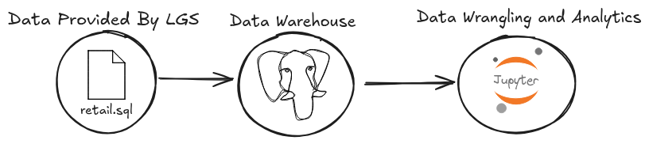

# Introduction

- **Business context**

   London Gift Shop (LGS) is a UK-based online retailer selling giftware products. While the company has operated its online store for many years, revenue growth has slowed in recent periods. A significant portion of LGS customers are wholesalers, which makes understanding customer purchasing behavior especially important for designing effective marketing strategies.

   The marketing team at LGS would like to use historical transaction data to gain better insight into how customers shop, what products generate the most value, and how purchasing patterns differ across customer segments and regions. These insights can then be used to support data-driven sales and marketing decisions.

- **How LGS would use the analytics results**

  The analytics results from this project help the LGS marketing team:
    - identify high-value, loyal, and at-risk customers,
    - understand customer purchase frequency, recency, and spending behavior,
    - design targeted marketing campaigns such as personalized email promotions, special offers for loyal customers, and win-back campaigns for inactive customers.

  By using these insights, LGS can improve customer retention, increase average order value, and ultimately drive revenue growth.

- **Work description and technologies used**

  In this PoC project, historical transaction data is analyzed using Python-based data analytics tools. The work includes data loading, data cleaning, feature engineering, exploratory analysis, and customer segmentation.  
  The main technologies used are:
  - Jupyter Notebook
  - Python
  - Pandas and NumPy for data wrangling and analysis
  - Matplotlib for visualization

# Implementation

## Project Architecture

- **Architecture description**

  This project follows a simple PoC architecture. Transaction data generated by the LGS online store is exported by the LGS IT team into a SQL file with customer personal information removed. The Jarvis team does not access the LGS cloud environment directly. Instead, the data is analyzed in a local or containerized environment using Jupyter Notebook.

  The analytics workflow processes the transaction data and produces insights that are shared with the LGS marketing team through the notebook and GitHub repository.

- **Architecture diagram**

  

## Data Analytics and Wrangling
- **Jupyter Notebook**

The full data analytics and wrangling process is implemented in the following notebook:

[`./python_data_wrangling/data/retail_data_analytics_wrangling.ipynb`](./python_data_wrangling/data/retail_data_analytics_wrangling.ipynb)

The transaction data can be used to support revenue growth in several ways:

- Perform RFM (Recency, Frequency, Monetary) analysis to segment customers into groups such as loyal customers, new customers, and customers who may require re-engagement.
- Use customer recency and frequency metrics to identify inactive or low-engagement customers and support basic win-back or retention campaigns.
- Analyze overall sales trends and customer purchasing patterns to help the marketing team understand how customers interact with the online store.
- Provide high-level insights that enable LGS to design targeted marketing strategies based on customer value and engagement level.

# Improvements

If more time were available, the following improvements could be made:
1. Refactor the notebook into modular Python scripts to improve maintainability and reusability.
2. Implement more advanced customer analytics such as customer lifetime value (CLV) estimation or churn prediction models.
3. Add automated data quality checks and schedule regular data refreshes to support ongoing analytics.

