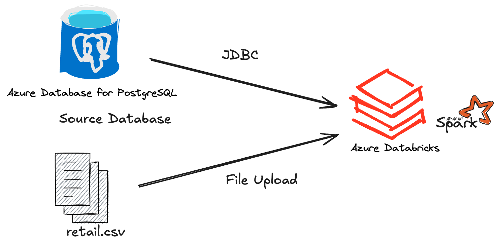

# Introduction

This project is built for the London Gift Shop (LGS) marketing team. In the previous Python Data Analytics project, the company used Jupyter Notebook and Python to analyze customer purchasing behavior and generate business insights for marketing campaigns. That solution was useful for exploratory analysis and for helping the business improve customer targeting and retention, but it ran on a single machine and could not scale well when the dataset became larger.

To address this limitation, this project re-designs the analytics workflow using Apache Spark so that data can be processed in a distributed environment. The main purpose of the project is to evaluate two Spark-based platforms, Databricks on Azure and Zeppelin on Hadoop. Databricks is used as the main environment for implementing the retail analytics workflow, while Zeppelin is used mainly to learn the notebook interface and understand how Spark can run in a Hadoop-based environment. This helps the team understand how Spark can support scalable data analytics across different enterprise platforms.

In this project, my work is mainly focused on building the retail data analytics workflow with PySpark in Databricks. I use the retail dataset to perform data wrangling, transformation, aggregation, and business analysis in the Databricks notebook. In the Zeppelin part, I mainly created three simple visualizations to learn the interface and basic workflow, since the main focus of the project is Databricks rather than Zeppelin. The technologies involved in this project include Apache Spark, PySpark DataFrame APIs, Databricks, DBFS, Azure, Zeppelin, Hadoop, Hive Metastore, JDBC, and notebook-based analytics.

# Databricks and Hadoop Implementation

The dataset used in this project is the London Gift Shop retail transaction dataset. It contains customer order records such as invoice number, stock code, quantity, invoice date, unit price, customer ID, and country. Using this dataset, I performed data analytics tasks such as data cleaning, removal of invalid or cancelled orders, revenue calculation, monthly sales trend analysis, and customer behavior analysis. The analytics workflow was implemented in PySpark inside a Databricks notebook. In the notebook, I only display 5 rows of the DataFrame for visualization purposes, because displaying the full DataFrame may cause GitHub to render the entire output after notebook export, making the notebook too long and difficult to read.

The notebook reads data either from a database through JDBC or from a file such as `retail.csv` uploaded into DBFS. After ingestion, PySpark DataFrames are used to clean and transform the data. I then apply grouping, aggregation, filtering, and other DataFrame operations to generate business insights. The notebook results are displayed inside Databricks using built-in notebook output features such as `display(df)`. The notebook should also be exported as both `.dbc` and `.ipynb` files and committed to the GitHub repository. You can add your notebook link here:

[Databricks Notebook Link](./notebook/retail_data_analytics_with_pyspark_.ipynb)

From an architecture perspective, Databricks runs on Azure and serves as the Spark execution environment. Data can be ingested into Databricks either by direct JDBC connection or by file upload into DBFS. DBFS acts as the storage layer for notebook-accessible files. PySpark is used as the main processing engine, and notebook cells are used to execute analytics logic and inspect results. In a more complete enterprise setup, Azure services can be integrated to manage data storage and metadata.

## Architecture Diagram

# Zeppelin and Hadoop Implementation

In the Zeppelin and Hadoop part of this project, the goal was mainly to get familiar with the Zeppelin notebook interface and understand how Spark jobs can be run in a Hadoop-based environment. Unlike the Databricks implementation, this part was not focused on building a complete analytics workflow. We did not perform full data cleaning or detailed data wrangling in Zeppelin.

Instead, I used the retail dataset to create three simple visualizations in Zeppelin and explore how the notebook interface works, how paragraphs are executed, and how results can be displayed. This helped me understand the basic Zeppelin workflow, but the main focus of the project remained on Databricks rather than Zeppelin.

[Zeppelin Notebook Link](./notebook/Spark_Dataframe_WDI_DA.zpln)

From the architecture perspective, Zeppelin serves as the notebook interface. In this setup, Spark processes the dataset and Zeppelin is used to run queries or PySpark code and display basic outputs and charts. Hive Metastore can also be part of the Hadoop ecosystem for metadata management. In this project, however, Zeppelin was mainly used as a lightweight learning environment to understand its interface and visualization capabilities rather than as the main platform for a full end-to-end analytics implementation.

# Future Improvement

- Improve the data ingestion process by replacing manual file upload with a more automated pipeline, such as scheduled database extraction or integration with cloud storage
- Optimize Spark performance by applying better partitioning, caching, and configuration tuning when processing larger datasets
- Add dashboards or more user-friendly visualizations for business users